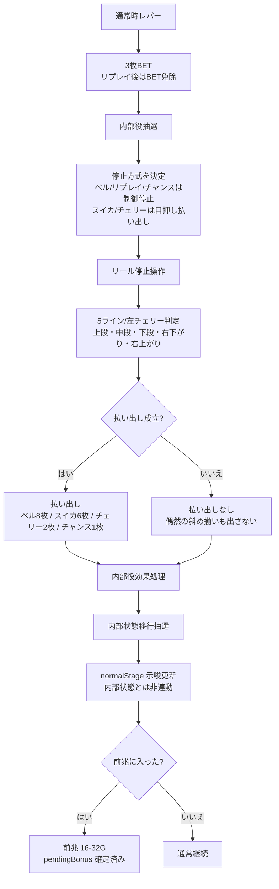
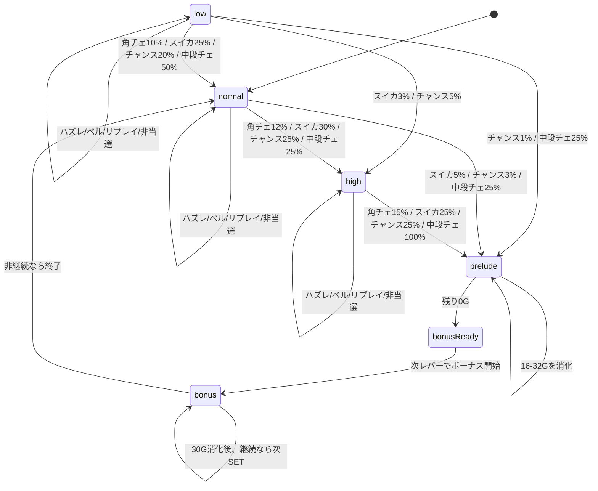
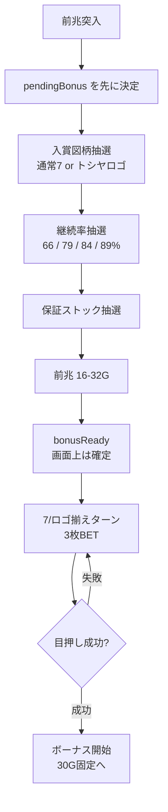
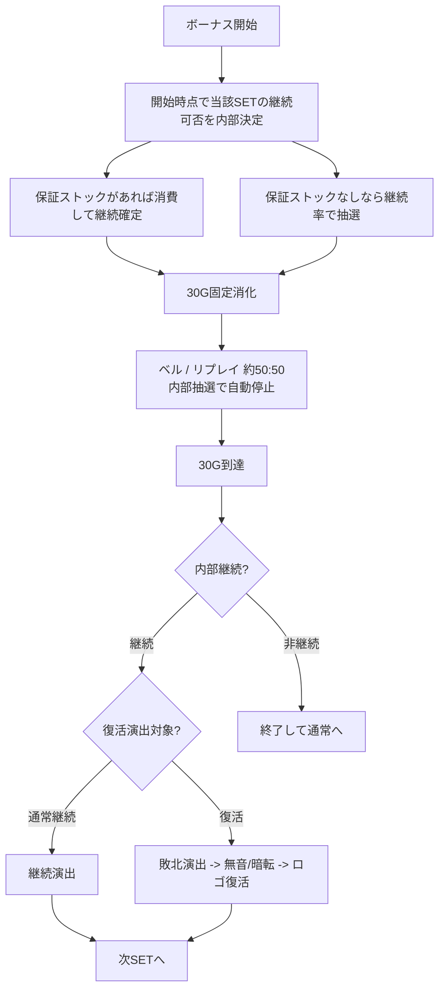
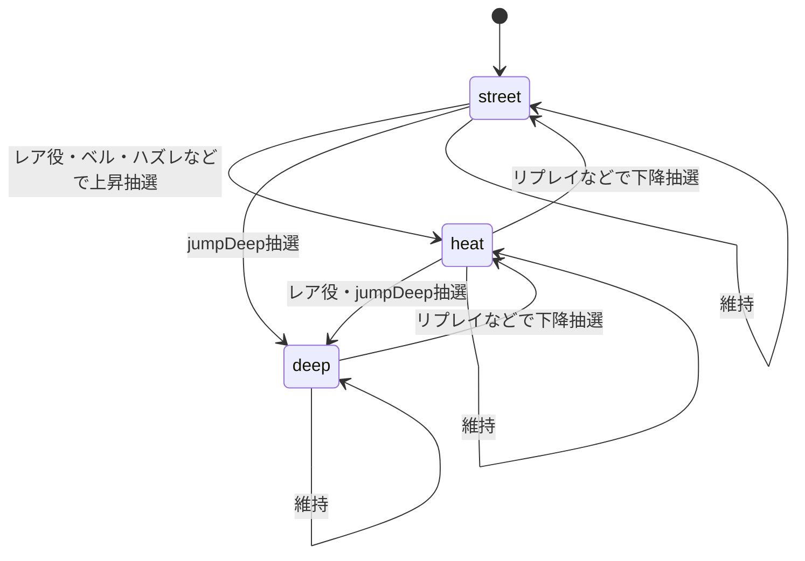
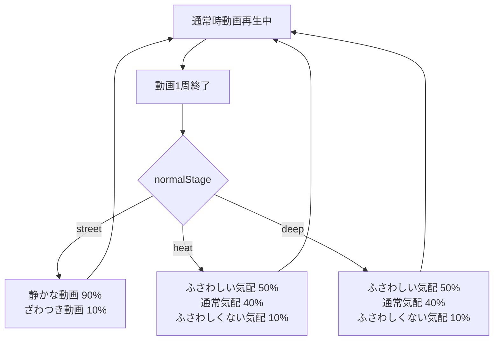

# トシヤイズムスロット V2 抽選・内部状態遷移図

この図は `src/v2/slot-v2-rules.js` と `src/v2/slot-v2-engine.js` の現在実装を基準にしたもの。
演出用の `normalStage` は内部状態そのものではなく、通常時動画の出やすさだけを変える示唆パラメータとして扱う。

## 1. 通常時 1G の抽選フロー

### 役抽選

| 役 | 確率 | 払い出し | 備考 |
| --- | ---: | ---: | --- |
| ベル | 1/40 | 8枚 | 通常時は内部成立したら必ず有効ラインへ自動停止。揃わない停止形は内部的にもハズレ |
| リプレイ | 1/7.3 | 0枚 | 通常時は内部成立時に有効ラインへ自動停止 |
| スイカ | 1/119 | 6枚 | 通常時は目押し成功時だけ払い出し。内部効果は失敗しても有効 |
| 角チェリー | 1/135 | 2枚 | 通常時は左リールにチェリーを出せば払い出し。右リールは不要。内部効果は失敗しても有効 |
| トシヤチャンス | 1/180 | 1枚 | 通常時は内部成立時に有効ラインへ自動停止。ロゴ抽選を少し優遇 |
| 中段チェリー | 1/247 | 2枚 | 通常時は左リールにチェリーを出せば払い出し。高確なら停止失敗でも前兆確定 |
| ハズレ | 残り約81.26% | 0枚 | 斜めを含む偶然揃いと左チェリーを避ける。stageだけ微変動あり |

通常時は、スイカ/角チェリー/中段チェリーだけ停止操作で払い出しが変わる。内部状態移行、前兆抽選、stage更新は停止失敗でも内部役どおりに処理する。

## 2. 内部状態の全体遷移

## 3. 低確・通常・高確の状態移行表

### 低確

| 成立役 | 移行先 | 確率 |
| --- | --- | ---: |
| 角チェリー | 通常 | 10% |
| スイカ | 通常 | 25% |
| スイカ | 高確 | 3% |
| トシヤチャンス | 通常 | 20% |
| トシヤチャンス | 高確 | 5% |
| トシヤチャンス | 前兆 | 1% |
| 中段チェリー | 通常 | 50% |
| 中段チェリー | 前兆 | 25% |

### 通常

| 成立役 | 移行先 | 確率 |
| --- | --- | ---: |
| 角チェリー | 高確 | 12% |
| スイカ | 高確 | 30% |
| スイカ | 前兆 | 5% |
| トシヤチャンス | 高確 | 25% |
| トシヤチャンス | 前兆 | 3% |
| 中段チェリー | 高確 | 25% |
| 中段チェリー | 前兆 | 25% |

### 高確

| 成立役 | 移行先 | 確率 |
| --- | --- | ---: |
| 角チェリー | 前兆 | 15% |
| スイカ | 前兆 | 25% |
| トシヤチャンス | 前兆 | 25% |
| 中段チェリー | 前兆 | 100% |

## 4. 前兆からボーナス開始まで

### 入賞図柄・ストック・継続率

| 図柄 | 基本比率 | 継続率振り分け | ストック振り分け |
| --- | ---: | --- | --- |
| 通常7揃い | 94 | 66%:55 / 79%:30 / 84%:11 / 89%:4 | 1個:70 / 2個:24 / 3個:6 |
| トシヤロゴ揃い | 6 | 66%:10 / 79%:35 / 84%:35 / 89%:20 | 2個:30 / 3個:28 / 4個:20 / 5個:12 / 7個:7 / 10個:3 |

補足:
- トシヤチャンス成立時はロゴ比率に +10。
- 中段チェリー成立時はロゴ比率に +12。
- ロゴ揃いは高継続率と大量ストックに寄るが、完走確定ではない。

## 5. ボーナス中の流れ

### ボーナス継続判定

| 項目 | 内容 |
| --- | --- |
| 1SET | 30G固定 |
| ボーナス中役 | ベル50 / リプレイ50。毎G内部抽選で決定 |
| 払い出し | 目押し不要。内部成立で8枚 |
| 継続率 | 66% / 79% / 84% / 89% |
| ストック | ある場合は1個消費して継続保証 |
| 復活 | 継続かつストックなしの一部。実装値は約15% |
| 終了 | 非継続なら `normal` へ戻る |

## 6. normalStage 示唆パラメータ

`normalStage` は `street / heat / deep` の3段階。内部状態を直接変えず、通常時動画の抽選重みだけを変える。

### stage更新確率

| 役 | 上昇 | 下降 | deep直行 |
| --- | ---: | ---: | ---: |
| ハズレ | 3% | 8% | 0.5% |
| ベル | 5% | 6% | 1% |
| リプレイ | 5% | 45% | 0.5% |
| 角チェリー | 45% | 6% | 8% |
| スイカ | 58% | 4% | 14% |
| トシヤチャンス | 65% | 3% | 18% |
| 中段チェリー | 78% | 2% | 26% |

重要:
- `normalStage` は内部状態と必ずリンクしない。
- レア役でも上がらないことがある。
- リプレイでも下がらないことがある。
- ハズレやベルでも上がることがある。

## 7. 通常時動画の選択

通常時動画は回転ボタンごとには切り替えない。動画が1周して `ended` したタイミングで、現在の `normalStage` を見て再抽選する。

例:
- heat: `normal_heat_comments` 50%、`normal_street_room` 40%、`normal_deep_rumble` 10%。
- deep: `normal_deep_rumble` 50%、`normal_street_room` 40%、`normal_heat_comments` 10%。
- `bonusReady` やボーナス開始は動画終了を待たず即切り替え。
